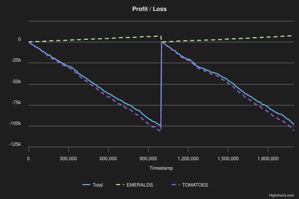
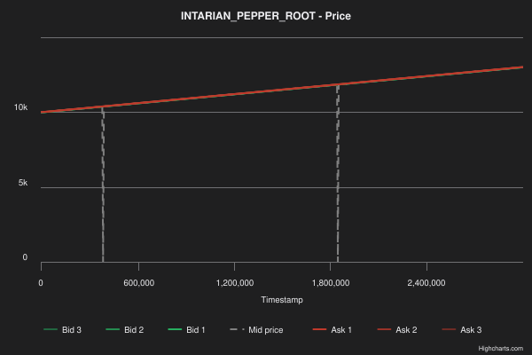
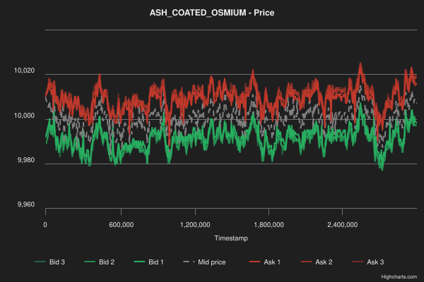
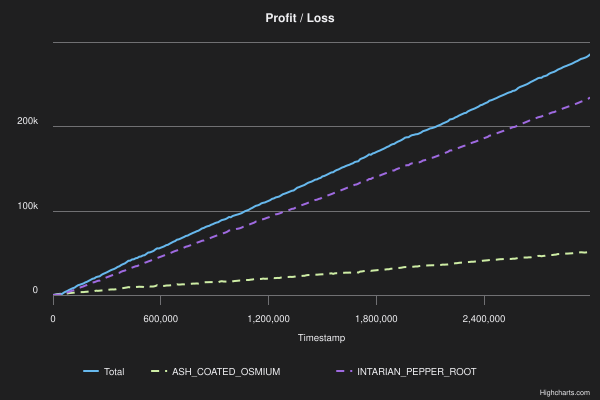
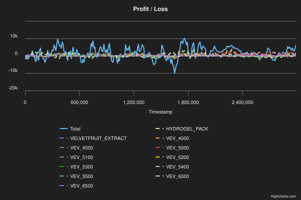

# Team Jawline

This is the work of Team Jawline on [IMC Prosperity 4](https://prosperity.imc.com/). We were ranked #3186 overall, #3036 in algorithmic, #2686 in manual and #787 in India out of 18,803 total teams overall.

## Team
<table>
  <tr>
    <td align="center" width="25%">
      
       
      <b><a href="https://www.linkedin.com/in/harnish-dave-79165136a/">Harnish Dave</a></b>
    </td>
    <td align="center" width="25%">
      
       
      <b><a href="https://www.linkedin.com/in/enerhim">Himanshu Sharma</a></b>
    </td>
    <td align="center" width="25%">
      
       
      <b><a href="https://www.linkedin.com/in/hiyansh-katlana-452280365/">Hiyansh Katlana</a></b>
    </td>
    <td align="center" width="25%">
      
       
      <b><a href="https://www.linkedin.com/in/param-damani-aa78683a7/">Param Damani</a></b>
    </td>
  </tr>
</table>

## Round 0 

`EMERALDS` was the stable product and `TOMATOES` was the noisy one in this round.
For Emeralds, the logic was market making around a fixed fair value of 10,000. We used the book to take mispricings, then quoted just inside the spread for queue priority.

For Tomatoes, we moved tried trend following:

$$
EMA_t = \alpha \cdot price_t + (1 - \alpha)\cdot EMA_{t-1}
$$

and a classic RSI-style momentum filter:

$$
RSI = 100 - \frac{100}{1 + \frac{\text{avg gain}}{\text{avg loss}}}
$$

### Backtesting PnL

We had a final PnL of 8.1k at the end of the demo round.

## Round 1

For Round 1, we,
- aggressively took the constant growth in `INTARIAN_PEPPER_ROOT`,
- run a mean-reversion model on `ASH_COATED_OSMIUM`.

For osmium, we used a hybrid signal built from Bollinger Bands and RSI.

The core definitions were:

$$
mid_t = \frac{best\_bid_t + best\_ask_t}{2}
$$

$$
\mu_t = \text{mean}(\text{last}_n \ \text{mids})
$$

$$
\sigma_t = \sqrt{\text{mean}\left((mid - \mu_t)^2\right)}
$$

$$
upper = \mu_t + k\sigma_t
$$

$$
lower = \mu_t - k\sigma_t
$$

RSI stayed the same idea:

$$
RSI = 100 - \frac{100}{1 + \frac{\text{avg gain}}{\text{avg loss}}}
$$

The logic was:
- strong buy only when both Bollinger and RSI agreed the product was oversold,
- strong sell only when both agreed it was overbought,
- soft lean when only one signal agreed,
- passive market making otherwise, with inventory skew.

A compact way to describe the fair value update is:

$$
fair = \mu_t + rsi_\text{bias}
$$

$$
rsi_\text{bias} = \frac{50 - RSI}{25}
$$

and the quote skew was adjusted by position so we did not keep leaning the wrong way forever.

### Backtesting PnL

At the end of the round, we had a net PnL of 92,708. To pass stage one, we needed to cross 200k PnL

## Round 2 

For Round 2, we did not bid anything. On backtesting the Round 1 algo on 70% of the trades, we barely saw any reduction in our PnL suggesting that even with lower market liquidity, our algo still performed fine. We did not want to risk not crossing the 200k PnL requirement.

In the manual round, we had to divide up 50k onto Research, Scale & Speed where PnL = (Research × Scale × Speed) − Budget_Used

Reearch was logarithmic:

$$
\text{Research}(x) = 200000 \frac{\log (1 + x)}{\log(1 + 100)}
$$

Scale was linear from 0 to 7 based on how much we invested

Speed was rank based where the highest recieves a 0.9 multiplier and the lowest 0.1 multiplier. 

We went with a 80/80/20 split across the three. Our net PnL for the round was 91,209 from algo and 110,754 from manual totalling 201,963 PnL.
This let us comfortably cross stage 1 and onto round 3

## Round 3

For `HYDROGEL_PACK`, the strategy used a hard fair-value anchor at 10k:
For `VELVETFRUIT_EXTRACT`, we used a slow EMA fair-value model:

$$
\mathrm{vev\_fair}_t = \alpha \cdot mid_t + (1-\alpha)\cdot \mathrm{vev\_fair}_{t-1}
$$

with a smoothing factor of `0.005`, making the estimate stable but slow to react during regime shifts.

For options pricing and hedging, we used Black–Scholes:

$$
C = S \cdot N(d_1) - K \cdot N(d_2)
$$

$$
d_1 = \frac{\ln(S/K) + 0.5\sigma^2T}{\sigma\sqrt{T}}
$$

$$
d_2 = d_1 - \sigma\sqrt{T}
$$

$$
\Delta = N(d_1)
$$

using round constants:

$$
\sigma = 0.22
\qquad
T = \frac{5}{252}
$$

Net delta exposure was computed as:

$$
\text{total velvet delta}
\=
\text{spot position}
+
0.3 \sum_i \bigl(\text{option position}_i \cdot \delta_i\bigr)
$$

The `0.3` scaling reduced over-hedging and helped avoid reacting excessively to noise.

### PnL

Our final PnL was, -57k after the round.
